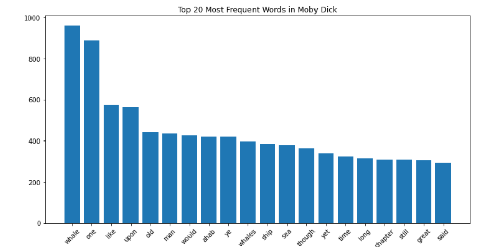
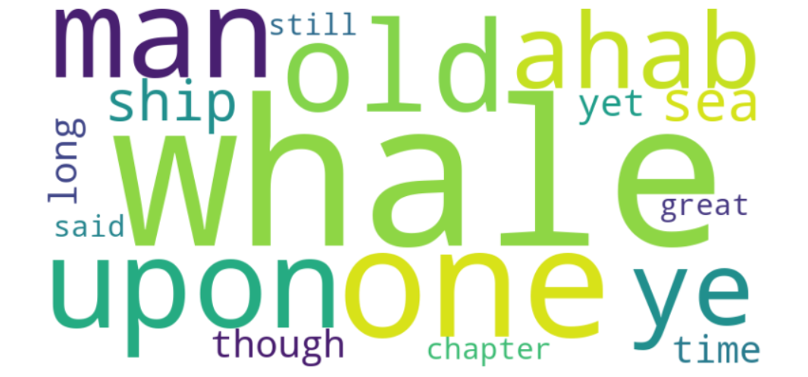

# Word Frequency Analysis of Moby Dick

This project performs a basic Natural Language Processing (NLP) analysis on the classic novel *Moby Dick* by Herman Melville.

## 🔍 Objective

To explore and visualize the most frequently used words in *Moby Dick* by:
- Scraping the book text from Project Gutenberg
- Cleaning and preprocessing the raw text
- Analyzing word frequency
- Visualizing the top words using charts or word clouds

## 🧰 Tools Used
- Python
- Requests
- BeautifulSoup
- nltk
- matplotlib / seaborn
- Jupyter Notebook

## 📚 Learning Highlights
- Gained hands-on experience with web scraping
- Learned HTML parsing and content extraction
- Practiced text cleaning and preprocessing
- Applied word frequency analysis using basic NLP
- Built a professional, portfolio-worthy project

## 📊 Top 20 Most Frequent Words

## ☁️ Word Cloud (Optional)

## 📦 Dataset Source
- [Project Gutenberg - Moby Dick](https://www.gutenberg.org/ebooks/2701)

## 🚀 Future Extensions
- Compare word usage across different classic novels
- Add sentiment analysis
- Build a simple Streamlit dashboard

---

*This project is part of my journey to become a skilled Data Analyst. Feedback is welcome!*
